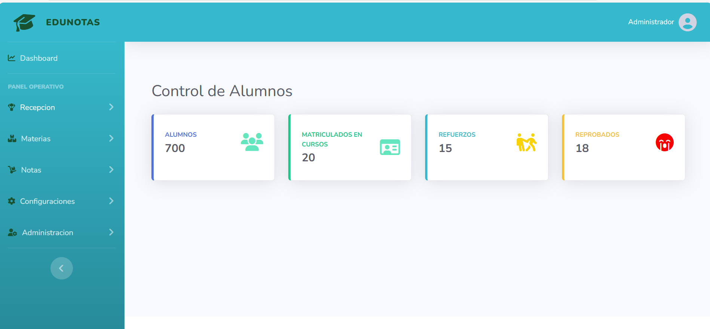

# 📘 Colegio EduNotas

Bienvenido a **Colegio EduNotas**, una aplicación web desarrollada en **Laravel** para la gestión académica de colegios.  
Con esta herramienta puedes llevar el control de **materias, notas, estudiantes y actividades escolares** de una manera moderna y organizada.

---

## 🌐 Landing Page

El sistema incluye una landing page atractiva con:

- 🎓 Sección de **presentación del colegio**.  
- 📚 **Carrusel de materias** (Matemáticas, Ciencias, Arte, Deportes).  
- 🏫 Información sobre **quiénes somos**.  
- 🏆 Actividades destacadas.  
- 📲 Footer con redes sociales.  

Diseñada con **Bootstrap 5, FontAwesome, Google Fonts y AOS animations**.


---

## 🚀 Tecnologías utilizadas

- [Laravel 10](https://laravel.com/) - Framework PHP
- [Bootstrap 5](https://getbootstrap.com/) - Estilos y componentes
- [FontAwesome](https://fontawesome.com/) - Iconos
- [AOS](https://michalsnik.github.io/aos/) - Animaciones en scroll
- [MySQL](https://www.mysql.com/) - Base de datos

---

## ⚙️ Instalación y Configuración

Sigue estos pasos para correr el proyecto en tu máquina local:

```bash
# 1. Clonar el repositorio
git clone git@github.com:grupo60esit/EduNotas.git

# 2. Entrar al directorio
cd EduNotas

# 3. Instalar dependencias
composer install

# 4. Copiar archivo de entorno
cp .env.example .env

# 5. Generar la key de la aplicación
php artisan key:generate

# 6. Configurar la base de datos en el archivo .env

# 7. Ejecutar migraciones
php artisan migrate

# 8. (Opcional) Cargar datos iniciales
php artisan db:seed

# 9. Levantar el servidor
php artisan serve
